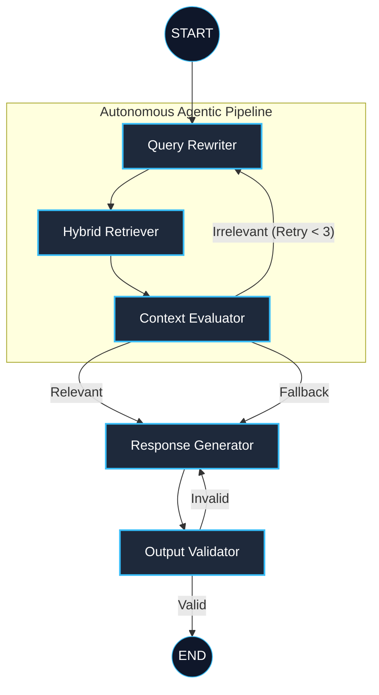

# RAGentX 🤖
**Autonomous Self-Correcting Multi-Agent RAG Orchestrator**

RAGentX is an enterprise-grade **Agentic Retrieval-Augmented Generation (RAG)** system designed to eliminate the common pitfalls of traditional RAG—such as irrelevant context retrieval and hallucinations. Built with **LangGraph**, it coordinates a team of specialized AI agents that collaboratively retrieve, evaluate, and self-correct their reasoning path in real-time.

---

## 🌟 Project Motivation
Standard RAG systems often suffer from "one-shot" failures: if the first retrieval is poor, the final answer is incorrect. **RAGentX** solves this by treating RAG as an iterative, agentic process. It introduces a **Reflexion Loop** where the system critiques its own retrieved context and autonomously decides whether to re-search, re-write the query, or proceed to generation.

---

## ✨ Key Features

### 🧠 Intelligent Orchestration (DAG)
RAGentX is governed by a stateful **Directed Acyclic Graph (DAG)** that manages complex state transitions between agent nodes.



- **Self-Healing Retrieval**: Implements an autonomous "Test-and-Repair" loop. If the **Evaluator** finds the retrieved documents insufficient, the system re-attempts retrieval with a refined query.
- **Hybrid Ensemble Search**: Combines **FAISS** (dense vector similarity) with **BM25** (sparse keyword matching) to maximize both semantic recall and term-based precision.
- **Cost-Optimized Architecture**: Runs **local HuggingFace embeddings** (`all-MiniLM-L6-v2`), removing expensive API dependencies for vectorization.
- **High-Fidelity Generation**: Leverages **Groq's Llama 3.3-70b-versatile** for near-instant reasoning and response generation.

### 🛠️ Developer Experience (DX)
- **Unified Entry Point**: Launch the complete stack (FastAPI + Streamlit) with a single command: `uv run python init_and_run.py`.
- **Transparent Traceability**: A built-in "Debug Mode" in the UI allows you to inspect the agent's internal reasoning, rewritten queries, and relevance scores.
- **Production-Ready Persistence**: Uses **SQLAlchemy** and **SQLite** to manage session-based chat history and document metadata.

---

## 🚀 Quick Start

### 1. Prerequisites
- Python 3.10+
- [uv](https://github.com/astral-sh/uv) (Fastest Python package manager)
- [Groq API Key](https://console.groq.com/keys)

### 2. Initialization & Setup
Run the automated setup script to sync dependencies and scaffold your environment:
```bash
# Windows
./setup.bat
```
Or manually:
```bash
uv sync
```

### 3. Configuration
Create a `.env` file in the root directory. You can use the provided `.env.example` as a template:
```bash
cp .env.example .env
```
Ensure your `.env` file has the following keys configured:
```env
GROQ_API_KEY=your_gsk_key_here
GROQ_MODEL_NAME=llama-3.3-70b-versatile
DATABASE_URL=sqlite:///./ragentx.db
FAISS_INDEX_PATH=vectorstore/faiss_index
```

### 4. Run Everything
```bash
uv run python init_and_run.py
```

---

## 📂 Project Structure
```text
app/
├── api/             # FastAPI REST endpoints (/chat, /ingest)
├── agents/          # LangGraph nodes and state orchestration
├── retrieval/       # Hybrid search and vectorstore logic
├── services/        # Centralized LLM factory
├── database/        # SQLite models and session management
├── core/            # Configuration and logging
frontend/            # Streamlit interactive dashboard
sample_data/         # Complex markdown documents for showcase testing
```

---

## 📋 Technical Stack
- **AI Framework**: LangChain & LangGraph
- **LLM Engine**: Groq (Llama 3.3-70b-versatile)
- **Vector Store**: FAISS
- **Retrieval**: Hybrid (Dense + Sparse Ensemble)
- **Embeddings**: HuggingFace (Local)
- **API**: FastAPI
- **Frontend**: Streamlit
- **Package Manager**: uv

---

## 📄 License
MIT
